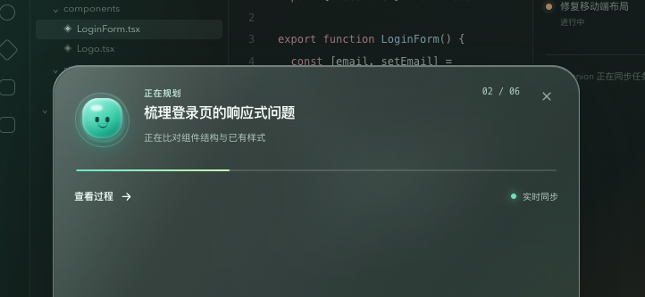
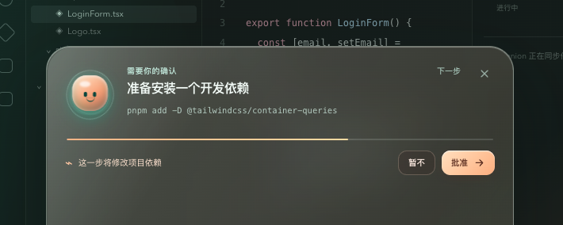
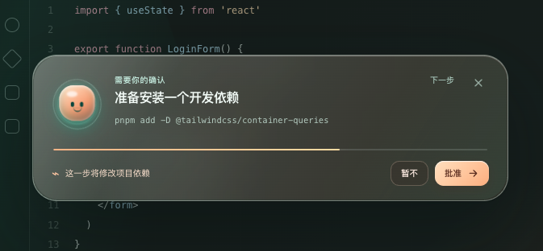

<div align="center">


# 🛰️ DSH 灵动岛

**给 [DeepSeek Harness](https://github.com/deepseek-ai/deepseek-harness) 的一只小玻璃伙伴——Agent 思考时它轻轻呼吸，干活时它微微脉动，要动你的东西之前，它还会先礼貌地问你一声。**

🍎 Liquid Glass 质感 · 🌱 零额外依赖 · 👀 时刻知道你的 Agent 在干嘛

[English](README.md) · [MIT](LICENSE)

</div>

---

> **状态：高保真设计原型** —— 为 DeepSeek Harness 设计、打磨、验证灵动岛形态的地方，之后才会变成真正的插件。⭐ 点个 Star，让这座小岛留在你的轨道上。

---

## 🪟 岛在工作区里的样子

| 安静地趴在角落 | 需要你时弹开 | 完成后留张小收据 |
|---|---|---|
|  |  |  |

小岛平时安静地待在工作区角落。一旦你的 Agent 开始做值得你知道的事——思考、跑工具、等你批准、或者碰了钉子——它就立刻活过来。

## 🧭 这是什么？

`dsh-dynamic-island` 是为 DeepSeek Harness 打造的苹果 **Liquid Glass** 风格灵动岛概念原型：把 Agent 的内心活动——思考、工具调用、审批、异常、完成——变成一块轻量、可读、带一点点陪伴感的小屏幕，趴在你屏幕的边缘。

它**不是**一只和任务无关的桌宠。每一次形态变化都来自真实的 Harness 状态：你永远知道 Agent 有没有在干活、在干什么、要不要你拍板、任务最后怎么样了。

## ✨ 你会喜欢它的理由

- 🍬 **货真价实的 Liquid Glass** —— 层层通透、带弹性的形态、会动的光。全部手写 CSS，不用任何 UI 库。
- 🎯 **状态优先，始终如一** —— 小伙伴的表情、核心光源、边缘色和文字说的是同一件事。绝不用假动画假装"AI 在思考"。
- 🤫 **低打扰设计** —— 没事就缩成一个小点。任务完成时留下一张小收据，然后安静回去。
- 🛡️ **尊重你的决定** —— 审批镜像 Harness 原生输入区：灵动岛只是第二个同步操作入口，绝不会自己替 Harness 做决定。
- ♿ **无障碍、有礼貌** —— 尊重 `prefers-reduced-motion`，不单靠颜色表达状态，审批按钮永远是真实可点的按钮。
- 🌱 **零运行时依赖** —— React + 一点点 CSS，仅此而已。

## 🎨 八种心情

| 心情 | 感觉 | 色调 |
|---|---|---|
| 🛰️ 待命 | `agent/status: idle` 时的安静小点——「随时吩咐」 | slate |
| 🧠 思考 | 核心轻轻呼吸；胶囊显示当前任务和步骤 | aqua |
| 🛠️ 执行 | 青绿脉冲——工具名和进度实时显示 | mint |
| 🫵 确认 | 暖珊瑚边缘——展开真实的「批准 / 暂不」按钮 | coral |
| ✅ 完成 | 一抹柔和的折射高光 + 结果小票 + 最近完成堆 | lime |
| ⚠️ 异常 | 橙色停顿——失败摘要和回到正轨的入口 | amber |
| 🔒 阻塞 | `turn/end {blocked}`——目标暂停，等你解除 | violet |
| ✂️ 上限 | `turn/end {max-tokens}`——输出被截断，可续跑 | rose |

## 🔌 它怎么和 DeepSeek Harness 对话

概念上把每一条 Harness 信号映射成一种岛的心情——一个窄的、可版本化的客户端状态协议，而不是一头扎进原始事件流：

| 岛的心情 | DSH 信号 |
|---|---|
| `idle` | `agent/status: idle` |
| `thinking` | `agent/status: running`、`step/start`、`assistant/chunk`（reasoning-delta） |
| `working` | `tool/call` → 对应的 `tool/result`（含 `error` / `meta`） |
| `approval` | 输入区有待处理的审批 |
| `complete` | `turn/end` 成功结束 + `assistant/message.usage` |
| `alert` | `tool/result` error、`agent/request-error`、`turn/end {error}` |
| `blocked` | `turn/end {blocked}` |
| `max-tokens` | `turn/end {max-tokens}` |

八态之上，每个心情还带**载荷字段**（流式预览、工具卡、小票、目标、清单、后台任务）：

| 岛上元素 | DSH 信号 |
|---|---|
| 流式预览行（思考/正文分色） | `assistant/chunk`（`text-delta` / `reasoning-delta`） |
| 工具命令卡（退出码 / 耗时 / 复制） | `tool/call.arguments` + `tool/result` |
| 结果小票（文件 / 检查 / tokens / 用时） | `turn/end.reason` + `assistant/message.usage` |
| 目标进度环 | goal 包：`roundsStarted` / 轮次上限 |
| 任务清单点 + 三态清单 | `todo/write`（整表快照，last-write-wins） |
| 后台任务胶囊 | jobs 包：`running \| stopping \| completed \| killed \| failed` + `detail` |
| 小票堆（最近完成） | `turn/end` 序列 |
| 模型徽章 | `request/context`（provider · model） |
| 停止 / 重试 / 解除阻塞 / 续跑 | `agent/turn-stopping` / `agent/request` / goal 解除 / turn 续跑 |
| 子代理注记 | `subagent/start` / `subagent/end` |

> 回放与持久化读 `session/event`；实时交互读 `agent/*`。正式插件还需要敲定当前版本允许的 client slot/connection 注入点——以及没有活动会话、事件流断开、多会话并行、HMR 重载这些边角规则。这些都在[路线图](#-路线图)上。
>
> 完整的「DSH 需要什么 × 信号层能不能做到 × 岛怎么呈现」分析见 [docs/analysis.md](docs/analysis.md)。

## 🚀 跑起来

```sh
npm install
npm run dev
```

打开 Vite 打印的地址——底部 `灵动岛演示` 栏可以切换八种心情：

- **确认**状态点「批准 / 暂不」，看小岛瞬间同步反映结果；
- 点「查看过程」展开岛内活动流：工具卡带退出码、耗时，还能一键复制命令；
- 点「清单」展开完整任务清单（三态勾选）；目标进度环显示 goal 轮次；
- **执行**态可点「停止」，**异常**态可点「重试」，**阻塞**态可点「解除阻塞」，**上限**态可点「继续」；
- 按住岛任意空白处可**拖拽**到任意位置（位置会记住，刷新后仍在）；
- 按 **⌘K**（或 Ctrl+K）打开命令面板，输入过滤、↑↓ 选择、↵ 执行；
- 点「▶ 自动演示」完整看一遍 待命 → 思考 → 执行 → 确认（自动批准）→ 完成 的弧线，按 **Esc** 随时收起。

## 🔌 集成进 DSH（插件化）

这个项目**就是**一枚 DSH 客户端插件 —— 仓库根即双面包插件包，已在 npm 发布（`dsh-dynamic-island`）：

```sh
# 直接装进 Harness（web profile）
dsh plugin --profile web add dsh-dynamic-island
dsh --profile web          # 重启 → 岛浮现在 GUI 右上角，可拖拽、位置记忆

# 或作为普通依赖（开发/引用浏览器半场）
npm install dsh-dynamic-island
```

本地开发时也可以从源码装（`npm run build:plugin` 产出 `lib/client.js` 后，
`dsh plugin --profile web add /path/to/this-repo`）。

机制已全部对照 DeepSeek Harness 源码核实：

- **注入点**：Web GUI 的 `shell.overlay` 浮层槽（ui-layout 专门为全屏浮层预留的
  加性 list 槽，目前零注册者），无需修改 apps/web 源码；
- **形态**：双面包 npm 包 —— `dsh.client` 声明 + `exports["./client"]` 浏览器半场
  （`lib/client.js`，`scripts/build-plugin.mjs` 产出 `__ModuleLoader__.load` 闭包工厂
  + 平台模块表 extern）+ 空 node 半场（`src/index.js`），`dsh plugin --profile web add <pkg>` 一条命令安装；
- **数据**：浏览器半场订阅 `ctx.sessions.currentProvideInfo` → 会话快照 + 投影
  （goal、todos、tokenUsage、contextPressure、permissions）→ `src/plugin/protocol.js`
  派生成岛模型 → **同一套** `src/components` React 组件渲染（demo 与插件共用一份 UI）。

仓库内已就位：`src/client/`（浏览器半场：index / IslandDock / island-store / live-bridge /
styles / locales）、`src/index.js`（node 半场）、`cordis.patch.yml`、
`src/plugin/protocol.js`（协议适配层）。完整方案、开发工作流与已知缺口见
[`docs/integration.md`](docs/integration.md)。

## 🧱 技术栈

- **React 19** + **Vite 8** —— 简洁快速
- **纯手写 CSS** —— 每一块玻璃、每一条轨道、每一次呼吸都是定制的
- **零 UI 框架** —— 重点是验证设计，不是炫技

## 🗺️ 路线图

- [x] 八种状态的 Liquid Glass 灵动岛（含待命 / 阻塞 / 上限）
- [x] 同步的审批操作（原生输入区的镜像）
- [x] 流式输出预览（`assistant/chunk`，思考/正文分色）
- [x] 工具命令卡片（退出码、耗时、复制）
- [x] 结果收据（文件、检查、tokens、用时）+ 最近完成小票堆
- [x] 目标进度环 + 完整任务清单（goal、`todo/write`）
- [x] 后台任务胶囊（jobs）+ 模型徽章（`request/context`）
- [x] ⌘K 命令面板 + 自动演示
- [x] 集成方案与插件骨架（仓库根即双面包客户端插件）
- [x] `build:plugin` 产出 loader 合规 bundle，冒烟通过（握手 / 工厂 / apply / 桥派生 / 动作面）
- [ ] 真实 GUI 联调（桥实机核对 + retry/continue/unblock/approve 接上真实远端）🚀

## 💛 让小岛留在轨道上

如果它让你会心一笑，点个 ⭐ —— 这是把设计原型变成真正插件的燃料。Issues、想法、"为什么还不支持 XXX" 统统欢迎。

为 DeepSeek Harness 社区，用 🫶 建造。
